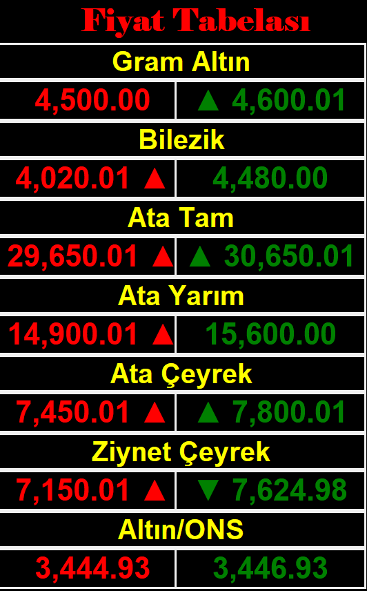

# Altın Fiyat Tabelası - LED Tabela Uygulaması

Bu proje, web sitelerinden altın fiyat verilerini çekerek LED tabela formatında görüntüleyen bir Python uygulamasıdır. Kuyumcu işletmeleri için tasarlanmıştır.

## Özellikler

- 🏆 **Gerçek Zamanlı Veri**: Web sitelerinden otomatik veri çekme
- 💰 **Altın Fiyatları**: Güncel alış-satış fiyatları
- 📊 **LED Tabela Görünümü**: Kuyumcu tabelası formatında
- 🎨 **Görsel Efektler**: Yanıp sönen başlık ve fiyat değişim animasyonları
- ⚡ **Otomatik Güncelleme**: 20 saniyede bir otomatik veri güncelleme
- 🖥️ **Tam Ekran Modu**: LED tabela görünümü için optimize edilmiş

## Kurulum

### Gereksinimler

- Python 3.7 veya üzeri
- Windows işletim sistemi (PowerShell)

### Adımlar

1. Projeyi klonlayın:
```bash
git clone https://github.com/Parrhesist/Led-Fiyat-Tabelas---Python.git
cd Led-Fiyat-Tabelas---Python
```

2. Gerekli paketleri yükleyin:
```bash
pip install -r requirements.txt
```

3. Uygulamayı çalıştırın:
```bash
python main.py
```

## Kullanım

- Uygulama başlatıldığında LED tabela formatında altın fiyatları görüntülenir
- Başlığa tıklayarak uygulamadan çıkabilirsiniz
- Fiyatlar otomatik olarak güncellenir
- Fiyat değişimleri görsel efektlerle gösterilir

## Yapılandırma

`main.py` dosyasındaki `url` değişkenini kendi veri kaynağınızla değiştirin:

```python
url = "https://yourwebsite.com/"
```

## Gereksinimler

- `tkinter` - GUI kütüphanesi
- `requests` - HTTP istekleri için
- `beautifulsoup4` - HTML parsing için

## Lisans

Bu proje [MIT Lisansı](LICENSE) altında lisanslanmıştır.

## Geliştirici

- **Mehmet Açıkgöz** - [mehmetacikgoz8585@gmail.com](mailto:mehmetacikgoz8585@gmail.com)
- **GitHub**: [Parrhesist](https://github.com/Parrhesist)

## Katkıda Bulunma

1. Bu repository'yi fork edin
2. Feature branch oluşturun (`git checkout -b feature/AmazingFeature`)
3. Değişikliklerinizi commit edin (`git commit -m 'Add some AmazingFeature'`)
4. Branch'inizi push edin (`git push origin feature/AmazingFeature`)
5. Pull Request oluşturun

## Destek

Herhangi bir sorun yaşarsanız, lütfen [GitHub Issues](https://github.com/Parrhesist/Led-Fiyat-Tabelas---Python/issues) sayfasında bildirin.

## Ekran Görüntüleri



*Uygulama çalışır durumda - LED tabela formatında altın fiyatları görüntüleniyor*

---

⭐ Bu projeyi beğendiyseniz yıldız vermeyi unutmayın!
